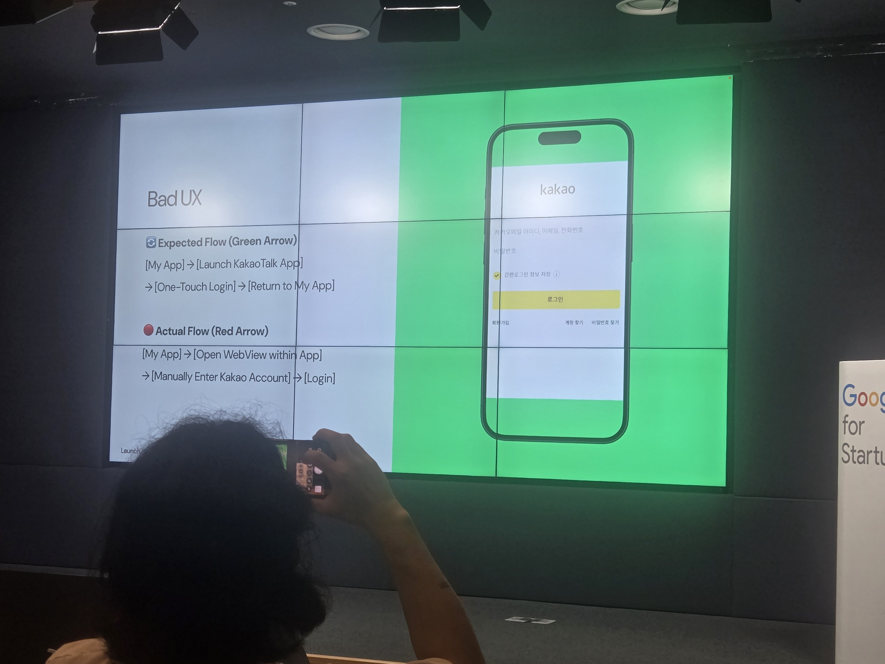
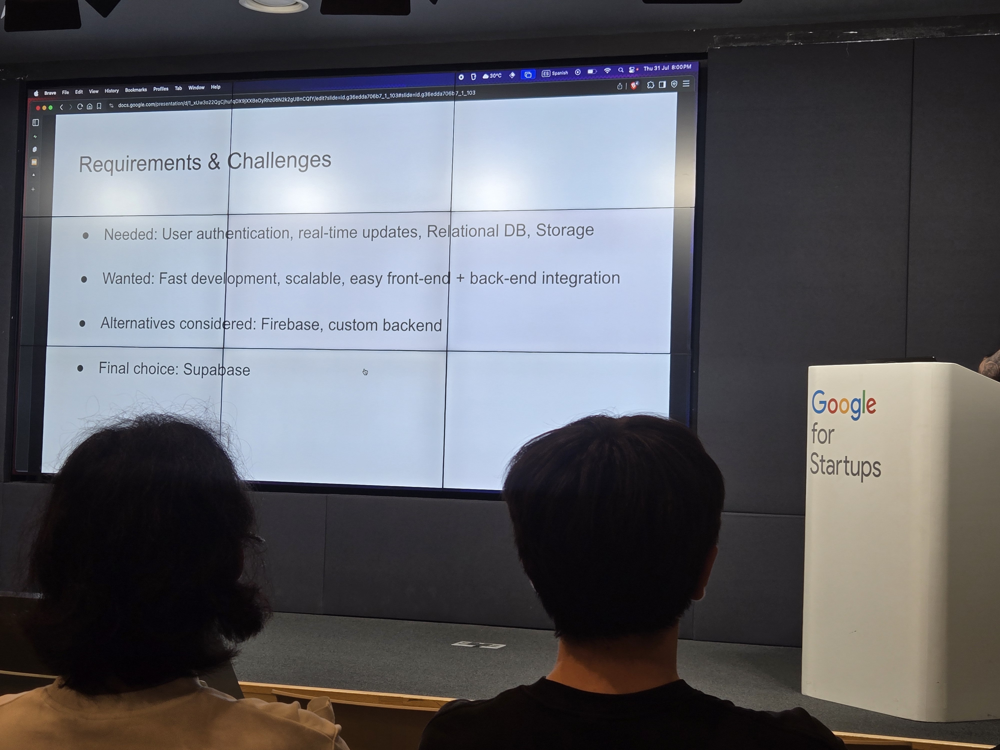

# Dev Korea Meetup - Supabase Launch Week 15

📅 **Date:** 2025-07-31  
📍 **Location:** Google Startup Campus, Seoul, Gangnam-gu, Yeongdong-daero 417  
🗣 **Language:** English

---

## Event Overview
Dev Korea의 첫 번째 오프라인 Meetup이었고,
영어로 소통하는 개발자, 디자이너, 기획자들이 모여 자유롭게 교류하는 자리였습니다.  
특히 Supabase Launch Week 15에 맞춰 Supabase를 활용한 실제 빌드 사례 발표가 있었습니다.

---

## Agenda 
- 🎤 Supercharging Kakao login on Supabase (Miryang Jung — Frontend engineer at grandeclip)
- 🎤 From scratch ideas to MVP with Supabase (Rigo Rosero Castillo — Senior frontend engineer)
- ☕ Networking & Light Snacks

## Agenda (Korean)
- 🎤 발표 1: Supabase를 활용한 카카오 로그인 고도화 (Miryang Jung)
- 🎤 발표 2: Supabase로 아이디어에서 MVP까지 (Rigo Rosero Castillo)
- ☕ 네트워킹 & 다과

---

## Reflection
Most of the participants in the meetup were foreign developers working in Korea. Many attended primarily for networking, so awareness of Supabase itself was relatively low. Supabase, similar to Firebase, allows frontend developers not only to easily create simple databases and design ERDs, but also to gain valuable support in backend development. It streamlines the entire process from project planning to deployment, which I found particularly impressive.

The first speaker shared their experience of enhancing Kakao login with Supabase. After facing difficulties with Kakao login integration, they reached out directly to Supabase and even contributed to its open source. Hearing this story was inspiring, giving me hope and motivation to contribute as a developer myself.

The second speaker, a frontend developer from Colombia, develops with the goal of building stronger connections and communication among foreign developers in Korea. He emphasized how Supabase helps frontend developers progress more easily into backend development. Through this meetup, I experienced firsthand the convenience of Supabase and thought it would be a tool I’d like to use someday for a solo project. Meeting developers who truly love their craft was both motivating and encouraging.

## Reflection (Korean)
밋업에 참가했던 대부분은 한국에서 일하고 있는 외국인 개발자들이었습니다. 네트워킹을 목적으로 온 사람들이 많았던 만큼, Supabase에 대한 인지도는 높지 않았습니다. Supabase는 Firebase와 유사하지만, 프론트엔드 개발자가 간단한 데이터베이스 생성과 ERD 작성까지 손쉽게 할 수 있고, 더 나아가 백엔드 개발에도 도움을 얻을 수 있는 도구임을 알 수 있었습니다. 프로젝트 기획부터 배포까지 과정을 간소화해 주는 점이 인상 깊었습니다.

첫 번째 발표자의 카카오 로그인 고도화 발표에서는, 카카오 로그인 연동 과정에서 어려움을 겪으면서 Supabase 측에 직접 연락하여 오픈 소스에 기여한 경험을 공유해주었습니다. 개발자로서 오픈 소스에 기여할 수 있다는 점에서 작은 희망과 도전을 받는 시간이었습니다.

두 번째 발표자는 콜롬비아 출신의 프론트엔드 개발자로, 한국에서 외국인 개발자들과의 교류와 소통을 목적으로 개발 활동을 하는 사람이었습니다. 그는 프론트엔드 개발자로서 Supabase를 활용해 백엔드 개발을 더욱 쉽게 진행할 수 있다고 강조했습니다. 이번 자리를 통해 Supabase의 편리함을 직접 경험할 수 있었고, 언젠가 1인 개발을 진행할 때 꼭 활용해보고 싶다는 생각을 하게 되었습니다. 개발을 진심으로 사랑하는 사람들을 만나면서 자극과 도전을 얻을 수 있었던 시간이었습니다.

---
## Photos
  

---

## Links
- [Dev Korea 공식 사이트](https://dev-korea.com/)  
- [LinkedIn](https://www.linkedin.com/company/dev-korea/)
